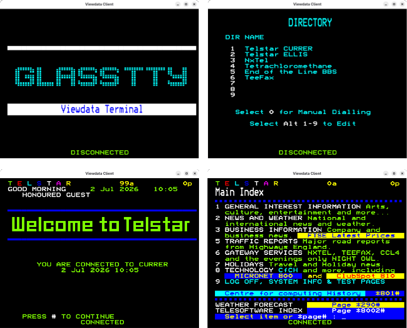

# Telstar Viewdata Client

This repository contains an experimental cross platform Viewdata Terminal.

This is a work in progress but as of v0.0.18 is usable albeit with a few compromises.

It currently works on the following platforms

* Linux (x64/arm64)
* MacOS (intel/Apple Silicon)
* Windows (x64/arm64)

It can be downloaded from the [releases section](https://github.com/johnnewcombe/telstar-client-avalonia/releases)  of this repository.

## Screen Shots



## Installation

### MacOS Installation

Download the appropriate zip from releases:
 
- `TelstarClient-macos-arm64-<version>.zip` — Apple Silicon (M1/M2/M3/M4)
- `TelstarClient-macos-x64-<version>.zip` — Intel

Extract the zip and move `TelstarClient.app` to your Applications folder.

#### First Run
  
As TelstarClient is not notarized with Apple, macOS may report it as damaged
or block it from running. To bypass this:

**Option 1 — Ctrl-click method:**

Ctrl-click the `TelstarClient.app` icon and select Open. This only needs to be done once.

**Option 2 — Terminal method:**
Execute the following command in a terminal.

```bash
xattr -cr /Applications/TelstarClient.app
```
Then double-click as normal.

**Option 3 — System Settings:**
System Settings → Privacy & Security → scroll down → click Open Anyway.

**Option 4 — Ad-hoc signing:**
If you have Xcode command line tools installed:
```bash
codesign --force --deep --sign - /Applications/TelstarClient.app
```
Then double-click as normal.

### Linux

Download the appropriate zip from releases:

- `TelstarClient-linux-arm64-<version>.zip` — arm64
- `TelstarClient-linux-x64-<version>.zip` — x64

```bash
$ ./install.sh
```
You will be presented with an option to install for all users or for the current user.
A suitable uninstall script will then be created allowing the program to be uninstalled.

### Windows

Download the appropriate setup executable from releases:

- `TelstarClient-Win-arm64-Setup-<version>.zip` — ARM 64
- `TelstarClient-Win-x64-Setup-<version>.zip` — x64

Run the downloaded setup program.

## Log Files

C:\Users\johnn\AppData\Roaming\TelstarClient\logs

* Linux = ~/.config/TelstarClient/logs
* macOS = ~/Library/Application Support/TelstarClient
* Windows = %APPDATA%/TelstarClient/logs

When using Windows, %APPDATA% can be determined by executing the following command...

```text
echo %APPDATA%
```


## Outstanding Development:

The following is a list of features that are planned for future release.

* Bug fixes, there are several known issues especially around the viewdata display and cursor control.
* Direct support for serial devices.
* Add support for 7bit even parity on serial and TCP connections.
